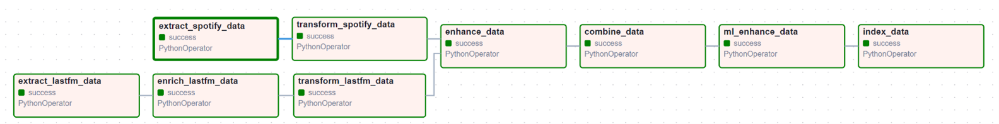
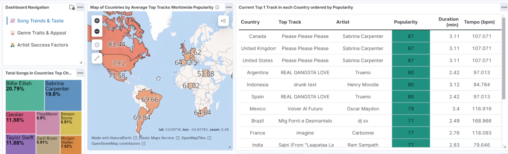

# Music Data Analysis Pipeline and Dashboard

    &nbsp;&nbsp;&nbsp;&nbsp;
     
    &nbsp;&nbsp;&nbsp;&nbsp;&nbsp;&nbsp;&nbsp;&nbsp;
     

## Introduction
This project focuses on analyzing music data to uncover trends in the industry, identify listener preferences across different countries, and explore factors contributing to artists' success. The data pipeline ingests and processes music data from two major platforms—**Spotify** and **Last.fm**—to combine insights from both sources.

The project showcases a complete end-to-end data pipeline that performs ingestion, transformation, augmentation, and visualization of music data. The goal is to demonstrate the capabilities of big data technologies for real-time analysis and visual representation of large-scale data.

## Features & Functionality
- **Data Ingestion**: Extracts top tracks and related information (audio features, popularity, listener counts) from Spotify and Last.fm APIs for 15 different countries.
- **Data Enrichment**: Enhances the Last.fm data with additional audio features from Spotify.
- **Data Transformation**: Formats and normalizes data using scalable processing tools, preparing it for analysis.
- **Data Augmentation**: Augments the datasets with artist and album details for comprehensive analysis.
- **Machine Learning Enhancement**: Applies clustering and dimensionality reduction techniques to uncover hidden patterns in the music data.
- **Dashboard Visualizations**: Presents insights on music trends, genre performance, and artist success via a Kibana dashboard.

## Project Structure
The project is organized into several key steps within the data pipeline, each having its own Airflow task.

### 1. Data Extraction:
- Extracts top tracks data from Spotify and Last.fm APIs.
- Stores raw data in Parquet format.

### 2. Data Enrichment:
- Augments the Last.fm data with audio features from Spotify.
- Ensures both datasets are comparable.

### 3. Data Transformation:
- Uses Apache Spark to clean and normalize the data, applying transformations such as scaling audio features and calculating new fields like track age and popularity categories.

### 4. Cross-Source Data Augmentation:
- Retrieves additional information about artists and albums from Spoeactify.
- Generates separate datasets for artists and albums.

### 5. Data Combination:
- Combines the extracted and enriched data sources using joins and aggregations.
- Generates multiple datasets, including:
  - **Unique Songs Dataset**: Aggregates unique songs with audio features, popularity metrics, and artist genres.
  - **Combined Top Charts Dataset**: Integrates top chart data from both Spotify and Last.fm.
  - **Genre Performance Metrics**: Computes average and peak performance statistics for each music genre.
  - **Artist Performance Statistics**: Collates data on each artist's global influence and recent successes.
  - **Viral Tracks of the Week**: Identifies the most popular tracks on Spotify released in the past week.
  - **Top Track per Country**: Details the highest-ranking Spotify song for each country with genre and artist information.

### 6. Machine Learning Enhancement:
- Applies KMeans clustering and t-SNE dimensionality reduction to group songs and reveal hidden relationships between genres.

### 7. Indexing & Visualization:
- Indexes the processed data into Elasticsearch for easy retrieval and visualization.
- Visualized in a Kibana dashboard, including charts, tables, and interactive maps.

## Technologies Used
- **Python**: For scripting and API interactions (Spotify, Last.fm).
- **Apache Airflow**: For orchestrating the end-to-end data pipeline.
- **Apache Spark**: For processing and transforming the large extracted datasets efficiently.
- **Elasticsearch**: For indexing data, which is used by the Kibana Dashboard for querying.
- **Kibana**: For visualizing insights through various charts and interactive maps.
- **Pandas**: For initial data handling and preprocessing.
- **Scikit-Learn**: For applying machine learning algorithms for dimensionality reduction and clustering.

## APIs Used
- [Spotify API](https://developer.spotify.com/documentation/web-api/)
- [Last.fm API](https://www.last.fm/api)

## Video, Screenshots & Illustrations

### DAG Structure:

### Kibana Dashboard:
- **Page "Song Trends & Taste"**

  
  
  
- **Page "Genre Traits & Appeal"**
  
  
  
  
- **Page "Artist Success Factors"**
  
  
  

### Presentation Video:
[Watch the presentation video](https://youtu.be/H_xVGKHc3zY)
